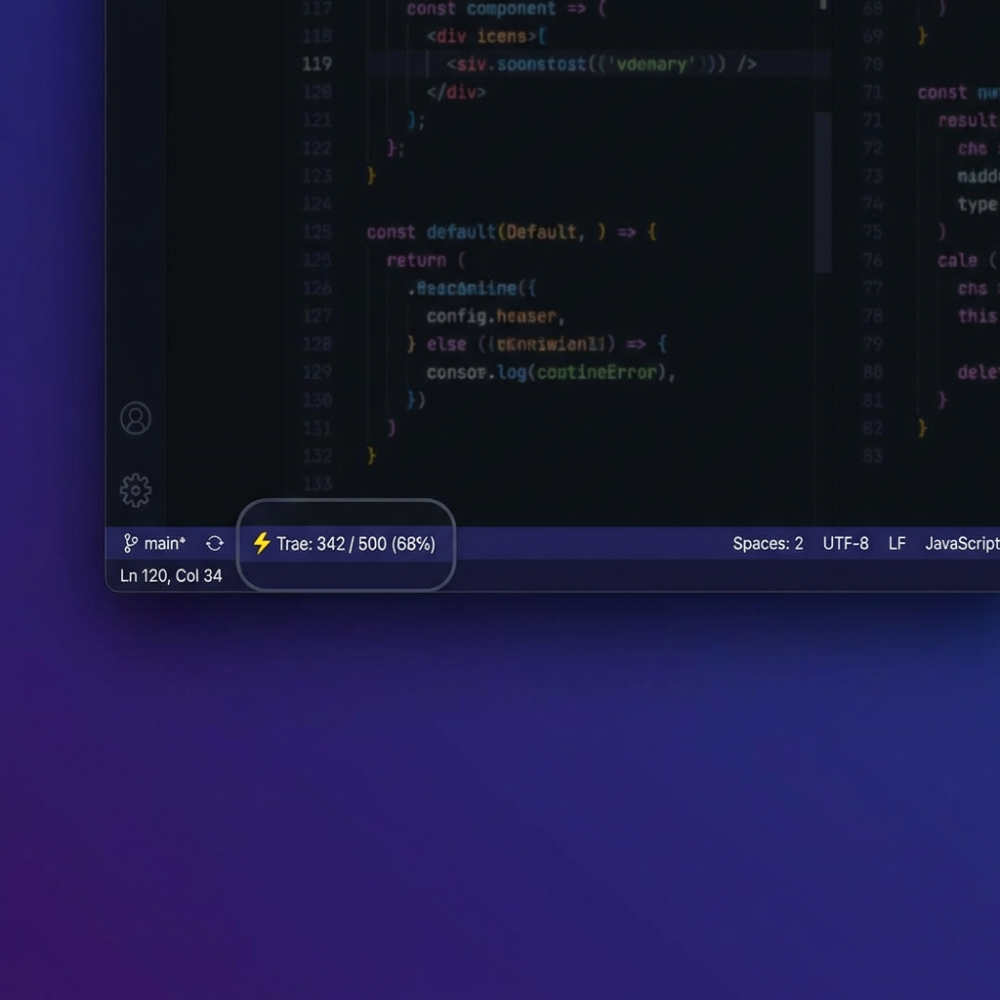

# Trae Usage Monitor ⚡

Real-time monitoring of your **Trae AI Fast Request** usage directly in your IDE status bar. 
在 IDE 状态栏实时监控您的 Trae AI 快速请求额度。



## One-Click Sync (New!) 🚀

Instead of manually copying the token, you can use this "Magic Bookmark" to sync your Trae token to VS Code in one click.

1.  Create a new bookmark in your browser (Chrome/Edge).
2.  Name it **"Sync Trae Token"**.
3.  Paste the following code into the **URL** field:

```javascript
javascript:(function(){const t=localStorage.getItem("Cloud-IDE-JWT")||(document.cookie.match(/Authorization=([^;]+)/)||[])[1];if(t){window.location.href="vscode://alanqin.trae-ai-usage-monitor/update?token="+t}else{alert("Please login to Trae first!")}})()
```

**Usage:**
1.  Open [Trae.ai](https://www.trae.ai) and ensure you are logged in.
2.  Click the bookmark.
3.  Click **"Open Visual Studio Code"** when prompted.
4.  Done! Your plugin is now updated with the latest token.

## Features ✨

*   **Real-time Updates**: Status bar updates automatically every 10 minutes.
*   **Detailed Breakdown**: Separately displays **💎 Pro Plan** and **🎁 Extra Packages**.
*   **Visual Indicators**:
    *   Shows **Used / Total Limit**.
    *   Shows **Remaining Percentage** (e.g., 82%).
    *   **Expiration Date** warning (e.g., Exp: 02/10).
    *   **Color Alerts**: Turns yellow/red when quota is running low (<10% remaining).
*   **Privacy Focused**: Your token is stored locally in your VS Code settings and only used to query the official Trae API.

## How to Get Your Token 🔑

1.  Log in to [Trae Account Settings](https://www.trae.ai/account-setting).
2.  Open Developer Tools (**F12** or Right Click -> Inspect) and go to the **Network** tab.
3.  Refresh the page.
4.  Find any request to `trae.ai` (e.g., `user_current_entitlement_list`).
5.  In the **Request Headers** section, find **Authorization**.
6.  Copy the entire value (starts with `Cloud-IDE-JWT ...` or just `eyJ...`).

## Configuration ⚙️

1.  Open IDE Settings (`Cmd + ,` or `Ctrl + ,`).
2.  Search for **Trae**.
3.  Paste your token into **Trae Monitor: Token**.
    *   (Optional) The **Trae Monitor: Api Url** is auto-configured, you usually don't need to touch it.

## Manual Refresh 🔄

Click on the status bar item to trigger an immediate refresh.

## License 📄

MIT

---

# Trae 额度监控 ⚡

在 IDE 状态栏实时监控您的 Trae AI 快速请求额度。

## 一键同步 Token (新功能!) 🚀

无需手动复制粘贴，您可以使用“魔法书签”一键将浏览器中的 Token 同步到 VS Code 插件中。

1.  在浏览器（Chrome/Edge）中新建一个书签。
2.  命名为 **"同步 Trae Token"**。
3.  在 **网址 (URL)** 栏中粘贴以下代码：

```javascript
javascript:(function(){const t=localStorage.getItem("Cloud-IDE-JWT")||(document.cookie.match(/Authorization=([^;]+)/)||[])[1];if(t){window.location.href="vscode://alanqin.trae-ai-usage-monitor/update?token="+t}else{alert("Please login to Trae first!")}})()
```

**使用方法：**
1.  打开 [Trae.ai](https://www.trae.ai) 官网并确保已登录。
2.  点击这个书签。
3.  浏览器弹出提示时，点击 **"打开 Visual Studio Code"**。
4.  搞定！插件会自动更新 Token 并刷新数据。

## 功能特性 ✨

*   **实时更新**：状态栏每 10 分钟自动刷新一次数据。
*   **详细分类**：分开显示 **💎 Pro 计划** 和 **🎁 加油包** 的额度。
*   **直观展示**：
    *   显示 **已用 / 总额度**。
    *   显示 **剩余百分比**（例如：82%）。
    *   **过期时间** 提醒（例如：Exp: 02/10）。
    *   **颜色告警**：当额度不足时（剩余 <10%），图标变色提醒。
*   **隐私安全**：您的 Token 仅保存在本地 VS Code 设置中，并仅用于查询 Trae 官方 API，绝不上传至任何第三方服务器。

## 如何获取 Token 🔑

1.  登录 [Trae 账户设置](https://www.trae.ai/account-setting)。
2.  打开开发者工具 (**F12** 或 右键 -> 检查)，并切换到 **网络 (Network)** 标签页。
3.  刷新页面。
4.  在列表中找到任意发往 `trae.ai` 的请求（例如搜索 `entitlement`）。
5.  在右侧的 **请求头 (Request Headers)** 中找到 **Authorization** 字段。
6.  复制其值（通常以 `Cloud-IDE-JWT` 或 `eyJ` 开头）。

## 配置方法 ⚙️

1.  打开 IDE 设置 (`Cmd + ,` 或 `Ctrl + ,`)。
2.  搜索 **Trae**。
3.  将您的 Token 粘贴到 **Trae Monitor: Token** 中。
    *   (可选) **API 地址** 通常无需修改，插件会自动使用默认地址。

## 手动刷新 🔄

点击状态栏上的图标即可立即强制刷新数据。

## 许可证 📄

MIT
